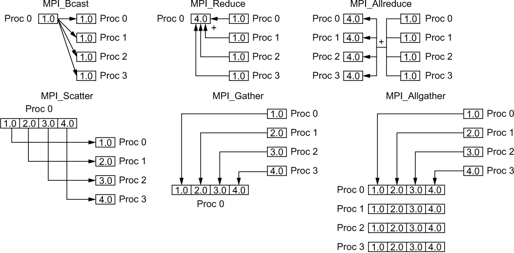

### Setup and Tear Down
**MPI_Init:** starts up the MPI runtime environment at the beginning of a run. MPI_Finalize shuts down the MPI runtime environment at the end of a run.

**MPI_Finalize:** shuts down the MPI runtime environment at the end of a run.

### Gathering Information
**MPI_Comm_size** gets the number of processes in a run, Np (typically called just after MPI_Init).

**MPI_Comm_rank** gets the process ID that the current process uses, which is between 0 and Np-1 inclusive (typically called just after MPI_Init).

 **MPI_Get_processor_name** is not often used in real code. We used it to prove to ourselves that "Hello, World!" was running on different machines. It returns the name of the machine that the code is running on.

### Communication
**MPI_Send** sends a message from the current process to some other process (the destination). 

**MPI_Recv** receives a message on the current process from some other process (the source). 

### Collective communication primitives:
1. Broadcast
2. Reduce
3. Gather
4. Scatter
5. AllReduce
6. AllGather
7. ReduceScatter

### Synchronization between MPI processes
MPI_Barrier(MPI_COMM_WORLD)

### Blocking vs Non-Blocking
Blocking communication is done using MPI_Send() and MPI_Recv(). These functions do not return (i.e., they block) until the communication is finished. Simplifying somewhat, this means that the buffer passed to MPI_Send() can be reused, either because MPI saved it somewhere, or because it has been received by the destination. Similarly, MPI_Recv() returns when the receive buffer has been filled with valid data.

In contrast, non-blocking communication is done using MPI_Isend() and MPI_Irecv(). These function return immediately (i.e., they do not block) even if the communication is not finished yet. You must call MPI_Wait() or MPI_Test() to see whether the communication has finished.

Blocking communication is used when it is sufficient, since it is somewhat easier to use. Non-blocking communication is used when necessary, for example, you may call MPI_Isend(), do some computations, then do MPI_Wait(). This allows computations and communication to overlap, which generally leads to improved performance.